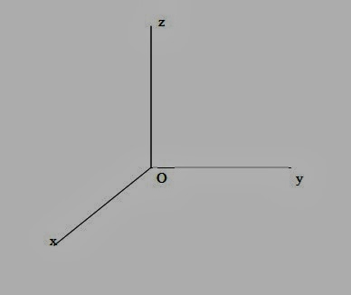

  

# Perkenalan

GIS Adalah software yang dirancang untuk menyimpan, menganalisis, dan memamanipulasi informasi yang bersifat spasial.  

Arti dari spasial sendiri adalah ruang, artinya GIS sendiri dirancang untuk informasi yang bereferensi keruangan lebih sempitnya bereferensi geografis 

Parameter yang dipakai untuk pengukurannya adalah Koordinat Kartesius siku siku karena informasi yang akan dipakai merupakan data yang bersifat spasial.  dibawah ini merupakan gambar dari Koordinat Kartesius

  

# Software yang digunakan

Pada matakuliah ini akan menggunakan Software QGIS yang bersifat opensource yang dengan lisensi dari  GNU General Public Licence, kemudian kita akan menggunakan <i><strong>Natural Earth</strong></i> yang berfungsi sebagai Plugin pada Gis untuk menampilkan layer layer yang menampilkan peta dunia.  

Sekian

link scan plagiarisme : https://drive.google.com/open?id=0B5nVZc89b7HgcE84OU8xdklNYUU

