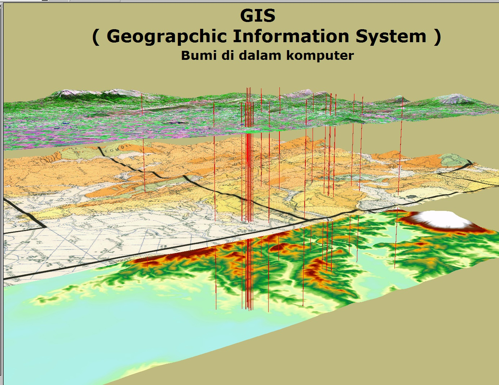

  

##Shapefile

Shapefile yaitu format dari suatu data geospasial yang umum digunakan untuk perangkat lunak Sistem Informasi Geografis. Shapefile ini merupakan kumpulan file yang berekstensi .shp .shx dan .dbf.fungsi dari shapefile ini sendiri yaitu untuk melakukan perhitungan jumlah kota yang ada pada ruang lingkup tertentu menggunakan beberapa sistem.

##Tools
Tools yang digunakan untuk melakukan create shapefile yaitu python dan plugin pyshp dengan cara import shapefile dan inisialisasi a=Shapefile.Writer() pada python.

File yang terdapat pada shapefile yaitu SHP dan DBF, pada SHP terdapat 3 tipe shapefile yaitu, Point, Polyline dan Polygon. Pada DBF pertama field untuk atribut tabel, contoh 'a=field('kata','B','50')', kedua isinya pada method, contoh 'a.record('jakarta')', ketiga a.save('file.shp') dimana file.shp nama file shapefie yang sebelumnya diinputkan.

##Cara menambahkan record

Pada Point = 'a.point(x,y)' atau 'a.point(x,y,0,0)' dengan domain x dan y adalah koordinat 
Pada Polyline = 'a.poly(shapefile=3,parts=[[[x1 ,y1 ,z1 ,w1 ],[ x2 ,y2 ,z2 ,w2 ],[……]]])' 
Pada Polygon = 'a.poly)shapefile=5,parts=[[[…….],[…….]]])' 
